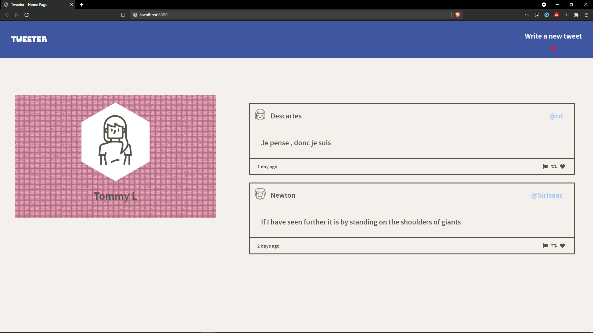
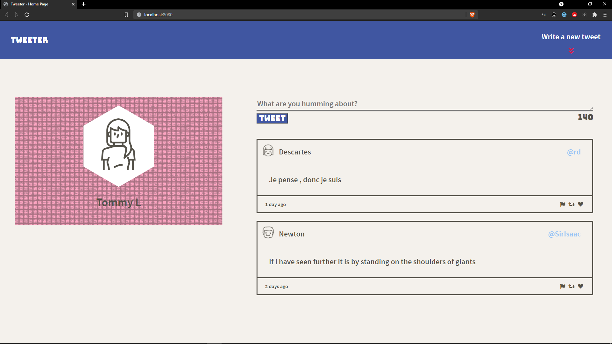
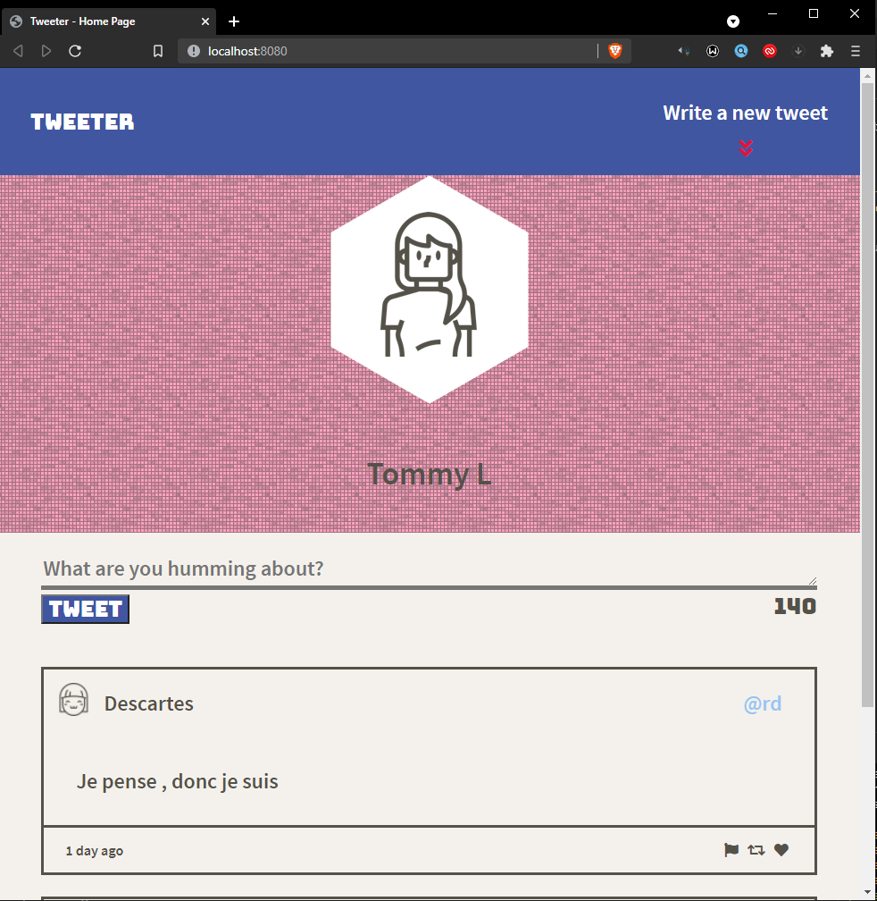

# Tweeter Project

Tweeter is a simple, single-page AJAX-based Twitter clone that uses jQuery, HTML5 and CSS3.

## Getting Started

1. Install dependencies using the `npm install` command.
2. Start the web server using the `npm run local` command. The app will be served at <http://localhost:8080/>.
3. Go to [Tweeter (http://localhost:8080)](http://localhost:8080/) in your browser.

## Screenshots

## Dependencies

- Node 5.10.x or above
- [Express](https://www.npmjs.com/package/express)
- [body-parser](https://www.npmjs.com/package/body-parser)
- [chance](https://www.npmjs.com/package/chance)
- [md5](https://www.npmjs.com/package/md5)

## License
[MIT](https://choosealicense.com/licenses/mit/)